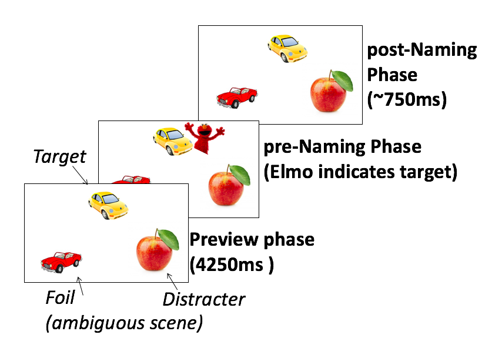

```{r setup, include=FALSE}
knitr::opts_chunk$set(cache=TRUE)
```
---
title: "Awareness and Monitoring in Children's Referential Communication."
author: "Hugh Rabagliati"
date: "First Draft -- 1 December 2015"
output:
  html_document:
    css: APAStyle.css
    fig_caption: yes
    highlight: zenburn
    theme: null
  pdf_document: default
  word_document:
    reference: APA.docx
csl: apa.csl
abstract: This is a brief introduction to R Markdown.
bibliography: 
  - ETRefLibrary.bib
references:

---


Children learning a language are not only required to master its structural features, such as phonology and syntax, but must also learn to communicate their message in effective ways. In particular, children must learn to produce utterances that are appropriately informative and unambiguous. If Little Jim owns both a red hat and a blue hat and wants to wear the red one, then it is uninformative for him to demand "I want my hat" (not to mention a little domineering). A more informative request would, instead, specify the appropriate hat. 

It is well established that learning to generate these appropriately informative utterances is a difficult task for young children: Preschoolers, and even young school-age children, who take part in referential communication tasks (an experimental analogue of the situation described above) frequently produce descriptions that are decidedly ambiguous and uninformative [@nilsen2009relations; @sonnenschein1984developing; @glucksberg1966referential; @glucksberg1967people]. But while children's difficulty with reference is well-established, exactly why this difficulty exists -- and why it persists so late in development -- remains something of a mystery.   

The most historically prominent explanation for children's difficulties with referential communication has focused on egocentricity: Children are assumed to be somewhat blind to the mental states of other people, and so they fail to take these states into account when communicating [@piaget1959language; @glucksberg1966referential; @krauss1969development]. But this idea has fallen out of favour, as study after study has demonstrated that children who are too young to communicate informatively are nevertheless surprisingly adept at reasoning about the mental states of others [@glucksberg1975development;  @wimmer_beliefs_1983; @onishi200515]. Consistent with this, recent work has shown that older children with ASD, who have difficulty taking the perspective of others, still show age-appropriate success in completing referential communication tasks [@fukumura2015development; see also @nadig2009adaptation].


An alternative approach has been to ask whether children's more general cognitive limitations, such as their still-developing working memory or executive function capacities, might play a role in their referential communication abilities [@cat_underpinnings_2015; @nilsen2009relations; @epley_perspective_2004; @varghese2013incentives]. Under these theories, children and adults are assumed to be similarly ego-centric (or at least, not particularly different), but they possess striking differences in their ability to over-ride that egocentrism and act in a communicatively appropriate fashion. For example, Nilsen [@nilsen2009relations] has suggested that, as adults, we rely on our executive functions to interpret other people's utterances without succombing to egocentric biases [see also @brown2009role; @epley_perspective_2004]. Consistent with this, she has found an increased use of egocentric biases in children who have relatively weak executive function skills [@nilsen2009relations; @nilsen2013communicative; @nilsen2015children]. But while it seems plausible that skills like inhibition, monitoring, or working memory may play some roles in the processes by which children formulate utterances, exactly which roles is unclear. 

Perhaps the major limiting factor for this analysis is that our current understanding of the moment-by-moment mechanisms involved in children's language production is too limited to offer much guidance. While we know an increasing amount about how children comprehend language online, we know much less about how they plan and structure their own utterances [although for recent examples of investigations using eye tracking, see @bunger2012relation; @norbury2014sources]. Previous work on children's referential communication has suggested strategies that children might learn to use [@glucksberg1975development;@sonnenschein1984developing; @whitehurst1981development], but has not tied these strategies in to a specific processing model of children's language production.

The adult psycholinguistics literature can provide some suggestions about what that processing model might look like. Recent work has suggested particular situations in which adults -- like children -- consistently generate expressions that are ambiguous and uninformative. An examination of the differences between the situations in which adults tend to be informative and the situations in which they do not can therefore potentially shed light on precisely which skills children must master in order to communicate in an adult-like way.

In particular, Ferreira and his colleagues [@ferreira_ambiguity_2008; @ferreira_how_2005] have shown that adults have a surprising difficulty avoiding what they have termed "linguistic" ambiguities. This difficulty can be easily seen in a simple referential communication task, in which participants had to name target pictures surrounded by multiple foils. In the critical manipulation, the target picture and one foil picture shared a lexically ambiguous label, for instance if the target was a baseball bat then the foil would be an animal bat. Adults were strikingly bad at noticing and avoiding ambiguity in this task: they frequently labeled the baseball bat as *bat* even though this also described its foil, a behavior that is strikingly similar to children's performance in referential communication tasks [@ferreira_how_2005; @rabagliati2013truth].

By contrast, adults have little difficulty avoiding non-linguistic ambiguities. The same adults who do not notice the ambiguity caused by a baseball and an animal bat, will naturally notice and account for the ambiguity caused by two different baseball bats. That is to say, adults do not notice ambiguity caused by overlap in linguistic representation alone (i.e., two different concepts with one label) but they do notice ambiguity caused by overlap in both conceptual and linguistic representations (i.e., two instances of one concept with one label). Interestingly, and importantly, adults' tendency to monitor for and avoid potential nonlinguistic ambiguity in their utterances does not seem to be dependent on the needs of a conversational partner, or indeed a partner's presence: Ferrerira and colleagues found that adults are as likely to avoid conceptual ambiguity when asked to describe pictures for a partner as when they are simply asked to describe pictures into a microphone. 

The findings discussed so far suggest that, when speaking, adults monitor for nonlinguistic ambiguity both proactively and automatically (i.e., without regard to the needs of their partner), while failing to proactively monitor for linguistic ambiguity. But this cannot be the entire story as, oftentimes, we do notice that the expression we have just produced is ambiguous. This suggests that monitoring does not only occur while we prepare an utterance, but also afterwards: speakers can re-comprehend their utterances and check for ambiguity or speech errors [cf. @levelt1983monitoring]. This monitoring can also help speakers to avoid ambiguity in their subsequent productions: Ferreria and colleagues [-@ferreira_how_2005] found that when asked to name a baseball bat followed by an animal bat (or vice versa), speakers may say *bat* for the first picture, but are likely to correct themselves and produce an unambiguous expression (*baseball bat*) for the second picture.

Ferreira's findings with adults suggest a more precise description of how referential skills develop, one in which children do not just move from being generally underinformative to being informative tout court, but in which they gradually learn a very particular set of skills. One is an automatic tendency to monitor for potential non-linguistic ambiguity before speaking. The other is a set of processes that can be deployed to evaluate whether their own just-produced speech is appropriately informative. Note that both of these processes could potentially be influenced by the executive function skills that have been argued to influence children's effective referential communication. 

To what degree do children's difficuties with effective communication derive from twin difficulties proactively monitoring for conceptual ambiguity and also re-interpreting their own utterances? In the experiments reported here, children and adults engaged in simple referential communication tasks while we tracked their pattern of gaze. The use of eye tracking allowed us to go beyond previous work by generating a precise record of whether and how children monitor for ambiguity, and how these monitoring processes relate to their production of informative referring expressions.

Since previous work on adults' ambiguity avoidance has not used eye tracking, we first demonstrated that both proactive monitoring and subsequent monitoring can indeed be measured with an eye tracker. To do this, in Experiment 1 we compared adults' eye movements as they completed referential communication tasks that involved either non-linguistic ambiguities (which should reveal use of proactive monitoring) or linguistic ambiguities (which should only reveal subsequent monitoring). Because adults often fail to inform about linguistic ambiguities, we reasoned that this would provide an analogue to children's performance. Our subsequent experiments, which only involved non-linguistic ambiguities, assessed whether proactive monitoring and production monitoring are operative in young children, and their relationship to children's tendency to produce either informative or uninformative utterances.

[ Tenney Apthorp unpublished ms looking at wherher kids monitor cited in whitehurst paper in Dickson book]   

#### Experiment 1.
```{r, echo=FALSE, results='hide',message=FALSE}
library(lme4)
library(doBy)
require(plyr)
require(longitudinalData)
sac.process2 = function(pathway = "./", Pop = "NA"){
	sac = c()
	for (i in unique(Pop)){
		for (j in c("Pre","Targ","Rew")){# Something is off with the reward section ,"Rew")){
		file.list <- list.files(path = pathway,full.names = T,pattern = paste(i,".*","Sac",j, sep = ""))
		print(file.list)
		sac.temp <- read.delim(file.list, header = T)
		sac.temp$Period = ifelse(j == "Targ","Naming",j)
		sac <- rbind(sac, sac.temp)	
		}
	}
	names(sac)[names(sac) == "RECORDING_SESSION_LABEL"] <- "Subj"
	names(sac)[names(sac) == "CURRENT_SAC_NEAREST_START_INTEREST_AREA_LABEL"] <- "SacStart"
	names(sac)[names(sac) == "CURRENT_SAC_NEAREST_END_INTEREST_AREA_LABEL"] <- "SacEnd"
	names(sac)[names(sac) == "CURRENT_SAC_END_TIME"] <- "SacEndTime"
	sac$Sac <- 1
	sac$SacSwitch <- ifelse(sac$SacStart == sac$SacEnd,0,1)
	sac$SacToTarg <- 0
	sac$SacFromTarg <- 0
	sac[sac$SacStart == "Pre_Targ " & sac$SacEnd == "Pre_D1 ",]$SacFromTarg <- 1
	sac[sac$SacStart == "Pre_D1 " & sac$SacEnd == "Pre_Targ ",]$SacToTarg <- 1
	sac$SacTarg <- 0
	sac[sac$SacStart == "Pre_Targ " & sac$SacEnd == "Pre_D1 ",]$SacTarg <- 1
	sac[sac$SacStart == "Pre_D1 " & sac$SacEnd == "Pre_Targ ",]$SacTarg <- 1

	sac$SacDist1 <- 0
	sac[sac$SacStart == "Pre_D1 " & sac$SacEnd == "Pre_D2 ",]$SacDist1 <- 1
	sac[sac$SacStart == "Pre_D2 " & sac$SacEnd == "Pre_D1 ",]$SacDist1 <- 1
	sac$SacDist2 <- 0
	sac[sac$SacStart == "Pre_Targ " & sac$SacEnd == "Pre_D2 ",]$SacDist2 <- 1
	sac[sac$SacStart == "Pre_D2 " & sac$SacEnd == "Pre_Targ ",]$SacDist2 <- 1
	sac <- sac[sac$type != "Filler",]
  sac$type <- factor(sac$type)
	sac$cond <- factor(sac$cond)
  contrasts(sac$cond)[1] <- -1
	contrasts(sac$type)[1] <- -1
	return(sac)
}

ad.sac <- sac.process2("./Expt1-Adults/EyeData/",c("AdSame","Homoph"))
ad.sac$order <- 1:length(ad.sac$SacTarg)
names <- read.delim("./Expt1-Adults/EyeData/AdultWriteNames.txt")
ad.sac <- merge(ad.sac,names, by = c("Subj","trialnum"), all.x = TRUE)
ad.sac<- ad.sac[order(ad.sac$order),]

ad.sac$dupic_sac <- NA
for (i in unique(ad.sac$Subj)){
  for (j in unique(subset(ad.sac, Subj == i)$trialnum)){
    ad.sac[ad.sac$Subj == i & ad.sac$trialnum ==j,]$dupic_sac <- (duplicated(subset(ad.sac, Subj == i & trialnum ==j)$SacEndTime,fromLast = TRUE)|duplicated(subset(ad.sac, Subj == i & trialnum ==j)$SacEndTime,fromLast = FALSE))
  }
}
#ad.sac <- ad.sac[ad.sac$dupic_sac == FALSE,]
ad.sac <- ddply(ad.sac, .(Subj,trialnum,Period), transform, CumTarg = cumsum(SacTarg),CumD1 = cumsum(SacDist1),CumD2 = cumsum(SacDist2), SacTime = SacEndTime - min(SacEndTime), SacBin = round((SacEndTime - min(SacEndTime))/100))

ad.sac$Item <- as.factor(sapply(strsplit(as.character(ad.sac$targname),"[.12]"), "[", 1))
# Create LabelCond variable; used for data analysis
ad.sac$LabelCond <- NA
ad.sac[ad.sac$cond == "Control" & ad.sac$Label %in% c(1,0),]$LabelCond <- "Control"
ad.sac[ad.sac$cond == "Ambig" & ad.sac$Label %in% c(1),]$LabelCond <- "Test-Ambig"
ad.sac[ad.sac$cond == "Ambig" & ad.sac$Label %in% c(0),]$LabelCond <- "Test-Unambig"
ad.sac$LabelCond <- as.factor(ad.sac$LabelCond)


ad.sac$Start <- "Preview"
ad.sac[ad.sac$Period == "Naming",]$Start <- ifelse(ad.sac[ad.sac$Period == "Naming",]$SacTime < ad.sac[ad.sac$Period == "Naming",]$StartTime,"Before","After")
ad.sac[ad.sac$Period == "Rew",]$Start <- "After"

summaryBy(Label + SacDist1+SacDist2+SacTarg ~Subj+Item+cond+type+Start, data = ad.sac, keep.names = T) -> Sac.sum
Sac.sum$SacOnTrial = ifelse(Sac.sum$SacTarg > 0,1,0)
```

**Methods**  
*Participants*   
`r length(unique(Sac.sum$Subj))` undergraduates from the University of Edinburgh (X female NEED TO CHECK THIS). Sample size was determined in advance by...

*Materials*   
Target-foil pairs consisted of sets of pictures depicting either two different things drawn from the same category (same-category ambiguity, e.g., two different cars) or two things drawn from different categories but sharing a name (linguistic ambiguity, e.g., a baseball bat and an animal bat). There were 16 pairs of each type. Target and foil pictures were counterbalanced between subjects (i.e., the same car was a target for half the subjects, and foil for remainder).

Adults received X trials overall (8 ambiguous scenes, 8 unambiguous scenes, and X filler trials that were also unambiguous). Ambiguity type was varied between subjects, so that half of the adults saw non-linguistic ambiguities, and half saw linguistic ambiguities. Scene type (ambiguous/unambiguous) was varied within subjects, using a Latin square design. 


*Procedure*   
The task was conducted using an EyeLink 1000 Eyetracker in remote mode, attached to an LCD monitor. We sampled from the right eye at 500Hz. Subjects first completed a six point calibration routine, using a picture of Elmo’s face as a target.

Each trial (see Figure C) began with a Preview phase, in which three pictures were displayed for 4250ms. Then, Elmo appeared next to one picture (the Pre-Naming phase), and a pre-recorded instruction asked participants “Which picture does Elmo like?” After participants answered, the experimenter pushed a button to end the trial: Elmo disappeared, but the pictures remained onscreen for 750ms, after which participants received further positive feedback from Elmo (the Post-Naming phase).  

<div style="width:400px; height277px">

**Figure C. Schematic of a sample trial.**   
</div>


*Analyses*   
We analyzed participants’ descriptions and their gaze behavior over the trial. We first coded whether participants provided referentially specific descriptions of the targets. We used a liberal coding scheme, coding any description as specific if it could not have been applied to the target’s foil. For instance, *small dog*, *dog on the left*, *Chihuahua* or *dog... that is small* counted as specific, but *dog* or *hound* did not. We analyzed responses using a mixed effects logistic regression; expressed using lmer syntax this regression had the form Label ~ 1 + Scene Type * Ambiguity Type + (1+Scene Type|Subject)+(1|Item)

Our eye movement analysis focused on saccades around the scene over the different trial phases. We defined regions of interest [ROIs, SIZE] around each of the three pictures, and analyzed saccades between the target picture and foil picture ROIs as a proportion of all saccades. We analyzed the proportion of saccades using a mixed effects regression model, of the form Proportion of Saccades ~ 1 + Scene Type * Ambiguity Type + (1+Scene Type|Subject)+(1|Item)
 
**Results**   
*Verbal Descriptions*
```{r, echo=FALSE, results='hide',message=FALSE}
ad.sac$InvLabel <- ifelse(ad.sac$Label == 1, 0, ifelse(ad.sac$Label == 0, 1,NA))
Labels <- summaryBy(InvLabel ~ trialnum+Subj + type + cond, data = ad.sac, keep.names = T,na.rm = T)
Labels$Label <- Labels$InvLabel
Labels <- summaryBy(Label ~ Subj + type + cond, data = Labels, keep.names = T,na.rm = T)
Labels <- summaryBy(Label ~ type + cond, data = Labels, FUN = c(mean,sd),na.rm = T)

format_coef <- function(lmer_model,row_no, SE = FALSE){
  lmer_coef_set <- coef(lmer_model)
  lmer_coef_set <- signif(lmer_coef_set,2)
  Beta <- lmer_coef_set[row_no,1]
  SE <- paste(ifelse(SE == TRUE,"(SE = ","("),lmer_coef_set[row_no,2],")",sep="")
  stat <- paste(substr(colnames(lmer_coef_set)[3],1,1), " = ", abs(lmer_coef_set[row_no,3]),sep="")
  p <- ifelse(substr(colnames(lmer_coef_set)[3],1,1) == "z",lmer_coef_set[row_no,4],signif(2*pnorm(-abs(lmer_coef_set[row_no,3])),2))
  p <- ifelse(p<0.001,"p < .001",paste("p = ",p, sep =""))
  output <- paste("(Beta = ",Beta,SE, ", ", stat, ", ",p,")", sep ="")
  
  return(output)
}

Expt1.Verbal <- summary(glmer(Label~cond*type + (1+cond|Subj)+(1|Item), data = subset(Sac.sum,  Start == "Preview"), family = "binomial"))

```
Participants were more likely to produce referentially specific descriptions for ambiguous scenes than unambiguous scenes, but  this effect was much smaller when the ambiguity was linguistic (Mean<sub>ambiguous</sub>=`r round(subset(Labels, type == "Homoph" & cond == "Ambig")$Label.mean,2) ` (SD=`r round(subset(Labels, type == "Homoph" & cond == "Ambig")$Label.sd,2) `), Mean<sub>unambiguous</sub>=`r round(subset(Labels, type == "Homoph" & cond == "Control")$Label.mean,2) `(`r round(subset(Labels, type == "Homoph" & cond == "Control")$Label.sd,2) `)) than when it was non-linguistic (Mean<sub>ambiguous</sub>=`r round(subset(Labels, type == "Same" & cond == "Ambig")$Label.mean,2) `(`r round(subset(Labels, type == "Same" & cond == "Ambig")$Label.sd,2) `), Mean<sub>unambiguous</sub>=`r round(subset(Labels, type == "Same" & cond == "Control")$Label.mean,2) `(`r round(subset(Labels, type == "Same" & cond == "Control")$Label.sd,2) `)). Our mixed effects model analysis confirmed that there was a significant effect of scene type `r format_coef(Expt1.Verbal, 2, SE = TRUE)` and no effect of ambiguity type `r format_coef(Expt1.Verbal, 3)`, but these were qualified by a reliable interaction between scene type and ambiguity type `r format_coef(Expt1.Verbal, 4)`:  Participants were reliably more likely to avoid non-linguistic ambiguity than linguistic ambiguity.

*Eye Movements*   
We divided the trial into three phases: 1) A Preview phase (before the to-be named picture was known), 2) A Pre-Naming phase (after Elmo appeared, but before the participant responded), and 3) A Post-Naming phase (from the participant’s response to the trial’s end). The time at which participants responded was coded offline from the recordings of their answers. Figure X shows the proportion of saccades between target and foil across phases of the trial for the linguistic ambiguity condition, and Figure Y shows the same for the non-linguistic ambiguity condition. 

```{r, echo=FALSE, results='hide',message=FALSE}
SacGraph <- function(Sac.graph){
  na.omit(summaryBy(SacTarg.mean~Start+cond, data = Sac.graph, FUN = c(mean,sd))) -> Sac.graph
  Sac.graph$Start <- factor(Sac.graph$Start, levels = c("Preview","Before","After"),labels = c("Preview","Before","After"), ordered = T)
  Sac.graph$SE = Sac.graph$SacTarg.mean.sd/sqrt(length(unique(Sac.sum$Subj)))
  
  Sac.graph$Time = "Pre-Naming"
  Sac.graph[Sac.graph$Start == "After" , ]$Time = "Post-Naming"
  Sac.graph[Sac.graph$Start == "Preview" , ]$Time = "Preview"
  Sac.graph$Time <- factor(Sac.graph$Time, levels = c("Preview","Pre-Naming","Post-Naming"),labels = c("Preview","Pre-Naming","Post-Naming"), ordered = T)
  Sac.graph$cond <- factor(Sac.graph$cond, levels = c("Control","Ambig"),labels = c("Control","Ambig"), ordered = T)
  tapply(Sac.graph$SacTarg.mean.mean, list(Sac.graph$cond,Sac.graph$Time), FUN = mean) -> o
  tapply(Sac.graph$SE, list(Sac.graph$cond,Sac.graph$Time), FUN = mean) -> se
  
  barplot(o, beside =T , ylim = c(0,0.3),col = "white",  border = NA, ylab = "Proportion Critical Saccades", names.arg = c("Preview", "Pre-Naming","Post-Naming"))
  legend(1.2,0.10, legend = c("Control Scene", "Ambiguous Scene"), bty = "n", col = c("blue","red"), pch = 20)
  points(c(1.5,4.3,7.3), o[1,], pch = 20, cex = 2, col = "blue")
  points(c(2.5,5.5,8.5), o[2,], pch = 20, cex = 2, col = "red")
  grid(nx = NA, ny = NULL, col = "gray", lty = "dotted",lwd = par("lwd"), equilogs = TRUE)
  abline(v = c(3.4,6.4), col = "grey", lty = "dashed")
  arrows(c(1.5,2.5,4.3,5.5,7.3,8.5), (c(o) + c(se)+0.01), c(1.5,2.5,4.3,5.5,7.3,8.5), (c(o) - c(se)-0.01), code = 0)
}
```

```{r, echo=FALSE, results='hide',message=FALSE}
# Homophones
SacGraph(na.omit(summaryBy(SacTarg~Start+cond+Subj, data = Sac.sum[ Sac.sum$type == "Homoph",], FUN = c(mean,sd), keep.names = T)))
```
   
**Figure X. Proportion of saccades between target picture and foil in the Linguistic Ambiguity condition, across time windows.***
```{r, echo=FALSE, results='hide',message=FALSE}
# Same Cat
SacGraph(na.omit(summaryBy(SacTarg~Start+cond+Subj, data = Sac.sum[ Sac.sum$type == "Same",], FUN = c(mean,sd), keep.names = T)))
```
   
**Figure Y. Proportion of saccades between target picture and foil in the Non-Linguistic Ambiguity condition, across time windows.***   


*Preview Phase*   
```{r, echo=FALSE, results='hide',message=FALSE}
Preview <- summaryBy(SacTarg ~ trialnum+Subj + type + cond, data = subset(ad.sac, Start == "Preview"), keep.names = T,na.rm = T)
Preview <- summaryBy(SacTarg ~ Subj + type + cond, data = Preview, keep.names = T,na.rm = T)
Preview <- summaryBy(SacTarg ~ type + cond, data = Preview, FUN = c(mean,sd),na.rm = T)

Expt1.Preview <- summary(lmer(SacTarg~cond*type + (1+cond|Subj)+(1|Item), data = subset(Sac.sum,  Start == "Preview")))
Expt1.Preview.Ho <- summary(lmer(SacTarg~cond + (1+cond|Subj)+(1|Item), data = subset(Sac.sum,  Start == "Preview" & type == "Homoph")))
Expt1.Preview.Same <- summary(lmer(SacTarg~cond + (1+cond|Subj)+(1|Item), data = subset(Sac.sum,  Start == "Preview" & type == "Same")))

```
Adults' eye movements during the Preview phase suggested that they were proactively monitoring for non-linguistic ambiguity, much more so than for linguistic ambiguity. Even before Elmo identified which picture was the target, we saw reliably more saccades between target and foil when a scene's ambiguity was non-linguistic 
(Mean<sub>ambiguous</sub>=
`r round(subset(Preview, type == "Same" & cond == "Ambig")$SacTarg.mean,2) ` 
 (
 `r round(subset(Preview, type == "Same" & cond == "Ambig")$SacTarg.sd,2) `
 ), Mean<sub>unambiguous</sub>=
 `r round(subset(Preview, type == "Same" & cond == "Control")$SacTarg.mean,2) `
 (`r round(subset(Preview, type == "Same" & cond == "Control")$SacTarg.sd,2) `
 ))
then when it was linguistic 
(Mean<sub>ambiguous</sub>=
`r round(subset(Preview, type == "Homoph" & cond == "Ambig")$SacTarg.mean,2) ` 
 (
 `r round(subset(Preview, type == "Homoph" & cond == "Ambig")$SacTarg.sd,2) `
 ), Mean<sub>unambiguous</sub>=
 `r round(subset(Preview, type == "Homoph" & cond == "Control")$SacTarg.mean,2) `
 (`r round(subset(Preview, type == "Homoph" & cond == "Control")$SacTarg.sd,2) `
 )).
 This was confirmed by a reliable interaction between scene type and ambiguity type 
 `r format_coef(Expt1.Preview, 4)`.
 This interaction qualified a reliable effect of ambiguity type, with more saccades overall when ambiguity was non-linguistic 
 `r format_coef(Expt1.Verbal, 3)`
, and a main effect of condition indicating more critical saccades for ambiguous scenes 
 `r format_coef(Expt1.Verbal, 2)`.   

We followed up this interaction by separately testing for effects of scene type in the non-linguistic and linguistic ambiguity trials, confirming that there was a robust effect for non-linguistic ambiguities 
 `r format_coef(Expt1.Preview.Same, 2)` 
 but only a marginal effect for linguistic ambiguities 
 `r format_coef(Expt1.Preview.Ho, 2)`.   
 
*Pre-Naming Phase*   
```{r, echo=FALSE, results='hide',message=FALSE}
Pre_N <- summaryBy(SacTarg ~ trialnum+Subj + type + cond, data = subset(ad.sac, Start == "Before"), keep.names = T,na.rm = T)
Pre_N <- summaryBy(SacTarg ~ Subj + type + cond, data = Pre_N, keep.names = T,na.rm = T)
Pre_N <- summaryBy(SacTarg ~ type + cond, data = Pre_N, FUN = c(mean,sd),na.rm = T)

Expt1.Pre_N <- summary(lmer(SacTarg~cond*type + (1+cond|Subj)+(1|Item), data = subset(Sac.sum,  Start == "Before")))


```
We expected that, for ambiguous scenes, participants would also produce more critical saccades during the pre-naming phase, particularly for non-linguistic ambiguities. However, while our data trended in that direction, the expected effects were not reliable. We found a slightly higher proportion of critical saccades on ambiguous scenes for both non-linguistic
(Mean<sub>ambiguous</sub>=
`r round(subset(Pre_N, type == "Same" & cond == "Ambig")$SacTarg.mean,2) ` 
 (
 `r round(subset(Pre_N, type == "Same" & cond == "Ambig")$SacTarg.sd,2) `
 ), Mean<sub>unambiguous</sub>=
 `r round(subset(Pre_N, type == "Same" & cond == "Control")$SacTarg.mean,2) `
 (`r round(subset(Pre_N, type == "Same" & cond == "Control")$SacTarg.sd,2) `
 ))
 and linguistic ambiguities 
 (Mean<sub>ambiguous</sub>=
`r round(subset(Pre_N, type == "Homoph" & cond == "Ambig")$SacTarg.mean,2) ` 
 (
 `r round(subset(Pre_N, type == "Homoph" & cond == "Ambig")$SacTarg.sd,2) `
 ), Mean<sub>unambiguous</sub>=
 `r round(subset(Pre_N, type == "Homoph" & cond == "Control")$SacTarg.mean,2) `
 (`r round(subset(Pre_N, type == "Homoph" & cond == "Control")$SacTarg.sd,2) `
 )). 
There was no overall effect of scene type 
 `r format_coef(Expt1.Pre_N, 2)`
, and no scene type by ambiguity type interaction 
 `r format_coef(Expt1.Pre_N, 4)`
, although there was a reliable effect of ambiguity type, indicating more critical saccades for non-linguistic rather than linguistic ambiguity trials 
 `r format_coef(Expt1.Pre_N, 3)`
 We attribute the two null effects to participants’ pro-active monitoring in the preview period, as well as participants’ short naming latencies (responses started, on average, after 1047ms [sd=505ms]). 

*Post-Naming Phase*   
```{r, echo=FALSE, results='hide',message=FALSE}
Post_N <- summaryBy(SacTarg  ~ trialnum+Subj + type + cond, data = subset(ad.sac, Start == "After"), keep.names = T,na.rm = T)
Post_N$SacOnTrial<- ifelse(Post_N$SacTarg > 0,1,0)
Post_N <- summaryBy(SacTarg + SacOnTrial~ Subj + type + cond, data = Post_N, keep.names = T,na.rm = T)
Post_N <- summaryBy(SacTarg + SacOnTrial~ type + cond, data = Post_N, FUN = c(mean,sd),na.rm = T)

Expt1.Post_N <- summary(lmer(SacTarg~cond*type + (1+cond|Subj)+(1|Item), data = subset(Sac.sum,  Start == "After")))
Expt1.Post_N.Trial <- summary(glmer(SacOnTrial~cond*type + (1+cond|Subj)+(1|Item), data = subset(Sac.sum,  Start == "After"), family = "binomial"))


```
Finally, we looked to see if participants monitored what they were saying aloud for ambiguity, using Ferreira and colleagues’ (2006) “production-based strategy”. Our initial analysis did not prvide strong evidence either way. While participants made more critical saccades in the non-linguistic ambiguity condition 
(Mean<sub>ambiguous</sub>=
`r round(subset(Post_N, type == "Same" & cond == "Ambig")$SacTarg.mean,2) ` 
 (
 `r round(subset(Post_N, type == "Same" & cond == "Ambig")$SacTarg.sd,2) `
 ), Mean<sub>unambiguous</sub>=
 `r round(subset(Post_N, type == "Same" & cond == "Control")$SacTarg.mean,2) `
 (`r round(subset(Post_N, type == "Same" & cond == "Control")$SacTarg.sd,2) `
 ))
than the linguistic ambiguity condition 
(Mean<sub>ambiguous</sub>=
`r round(subset(Post_N, type == "Homoph" & cond == "Ambig")$SacTarg.mean,2) ` 
 (
 `r round(subset(Post_N, type == "Homoph" & cond == "Ambig")$SacTarg.sd,2) `
 ), Mean<sub>unambiguous</sub>=
 `r round(subset(Post_N, type == "Homoph" & cond == "Control")$SacTarg.mean,2) `
 (`r round(subset(Post_N, type == "Homoph" & cond == "Control")$SacTarg.sd,2) `
 ))
, this interaction was not reliable 
 `r format_coef(Expt1.Post_N, 4)`
. There was also no overall effect of scene type 
 `r format_coef(Expt1.Post_N, 2)`
although there was again an effect of ambiguity type 
 `r format_coef(Expt1.Post_N, 3)`
.   

Surprised by this null result, we looked closer at the data to see if a focus on overall proportions was masking another effect. Instead, we analyzed the proportion of trials that contained a critical saccade (using a mixed effects logistic regression). This data was consistent with subsequent monitoring. Participants made critical saccades on more trials when the scene was ambiguous, and this did not appear to depend on whether the ambiguity was non-linguistic
(Mean<sub>ambiguous</sub>=
`r round(subset(Post_N, type == "Same" & cond == "Ambig")$SacOnTrial.mean,2) ` 
 (
 `r round(subset(Post_N, type == "Same" & cond == "Ambig")$SacOnTrial.sd,2) `
 ), Mean<sub>unambiguous</sub>=
 `r round(subset(Post_N, type == "Same" & cond == "Control")$SacOnTrial.mean,2) `
 (`r round(subset(Post_N, type == "Same" & cond == "Control")$SacOnTrial.sd,2) `
 ))
 or linguistic 
 (Mean<sub>ambiguous</sub>=
`r round(subset(Post_N, type == "Homoph" & cond == "Ambig")$SacOnTrial.mean,2) ` 
 (
 `r round(subset(Post_N, type == "Homoph" & cond == "Ambig")$SacOnTrial.sd,2) `
 ), Mean<sub>unambiguous</sub>=
 `r round(subset(Post_N, type == "Homoph" & cond == "Control")$SacOnTrial.mean,2) `
 (`r round(subset(Post_N, type == "Homoph" & cond == "Control")$SacOnTrial.sd,2) `
 ))
. This was reflected in a reliable effect of scene type 
 `r format_coef(Expt1.Post_N.Trial, 2)`
. The effect of ambiguity type was only marginal 
 `r format_coef(Expt1.Post_N.Trial, 3)`
and the interaction was not reliable 
 `r format_coef(Expt1.Post_N.Trial, 4)`
.


**Discussion**   
Our results not only replicate that participants are more likely to avoid non-linguistic ambiguity than linguistic ambiguity when speaking, but provide new insight into how it is that they do. Participants' eye movements provided direct evidence that they pro-actively monitor for non-linguistic ambiguity before they begin speaking, but that they do not notice or monitor for linguistic ambiguity. Participants’ eye movements also indicated that they monitored the words that they subsequently produced for both types of ambiguity.   

However, the main result of Experiment 1 – direct evidence that participants explicitly monitor for potential conceptual ambiguity before they begin speaking – is open to an alternative interpretation. In particular, it is possible that participants deduced the structure of the task and realized that, when a conceptual ambiguity was present, one of those two pictures was more likely to be mentioned. We conducted a follow-up experiment to assess this possibility, using the same non-linguistic ambiguity stimuli as in Experiment 1. However, rather than ask participants to verbally describe the target picture, we instead asked them to simply point at it. If participants' eye movements in the Preview phase of Experiment 1 were driven by pro-active monitoring, then we would not expect to find the same gaze patterns here, since points are unambiguous and do not need elaboration. But if the gaze patterns in Experiment 1 were due to task demands, we would still expect participants to saccade between target and foil in Experiment 1a.

**Experiment 1a**   
**Methods**   
*Participants*   
12 undergraduates from the University of Edinburgh (X female).

*Materials and Procedure*   
We used the exact same materials and procedure as in the conceptual ambiguity condition of Experiment 1, except that we replaced the instruction phrase with XXXX. 

**Analyses and Results**   

```{r, echo=FALSE, results='hide',message=FALSE}
library(doBy)
library(lme4)
require(plyr)
require(longitudinalData)
sac.process2 = function(pathway = "./", Pop = "NA"){
	sac = c()
	for (i in unique(Pop)){
		for (j in c("Pre","Targ","Rew")){# Something is off with the reward section ,"Rew")){
		file.list <- list.files(path = pathway,full.names = T,pattern = paste(i,".*","Sac",j, sep = ""))
		print(file.list)
		sac.temp <- read.delim(file.list, header = T)
		sac.temp$Period = ifelse(j == "Targ","Naming",j)
		sac <- rbind(sac, sac.temp)	
		}
	}
	names(sac)[names(sac) == "RECORDING_SESSION_LABEL"] <- "Subj"
	names(sac)[names(sac) == "CURRENT_SAC_NEAREST_START_INTEREST_AREA_LABEL"] <- "SacStart"
	names(sac)[names(sac) == "CURRENT_SAC_NEAREST_END_INTEREST_AREA_LABEL"] <- "SacEnd"
	names(sac)[names(sac) == "CURRENT_SAC_END_TIME"] <- "SacEndTime"
	sac$Sac <- 1
	sac$SacSwitch <- ifelse(sac$SacStart == sac$SacEnd,0,1)
	sac$SacToTarg <- 0
	sac$SacFromTarg <- 0
	sac[sac$SacStart == "Pre_Targ " & sac$SacEnd == "Pre_D1 ",]$SacFromTarg <- 1
	sac[sac$SacStart == "Pre_D1 " & sac$SacEnd == "Pre_Targ ",]$SacToTarg <- 1
	sac$SacTarg <- 0
	sac[sac$SacStart == "Pre_Targ " & sac$SacEnd == "Pre_D1 ",]$SacTarg <- 1
	sac[sac$SacStart == "Pre_D1 " & sac$SacEnd == "Pre_Targ ",]$SacTarg <- 1

	sac$SacDist1 <- 0
	sac[sac$SacStart == "Pre_D1 " & sac$SacEnd == "Pre_D2 ",]$SacDist1 <- 1
	sac[sac$SacStart == "Pre_D2 " & sac$SacEnd == "Pre_D1 ",]$SacDist1 <- 1
	sac$SacDist2 <- 0
	sac[sac$SacStart == "Pre_Targ " & sac$SacEnd == "Pre_D2 ",]$SacDist2 <- 1
	sac[sac$SacStart == "Pre_D2 " & sac$SacEnd == "Pre_Targ ",]$SacDist2 <- 1
	sac <- sac[sac$type != "Filler",]
	sac$cond <- factor(sac$cond)
  contrasts(sac$cond)[1] <- -1
	
	return(sac)
}

ad.sac <- sac.process2("./Expt1a-AdultsSilent/EyeData/",c("AdSil"))
ad.sac$order <- 1:length(ad.sac$SacTarg)
names <- read.delim("./Expt1a-AdultsSilent/EyeData/AdultWriteNames.txt")
ad.sac <- merge(ad.sac,names, by = c("Subj","trialnum"), all.x = TRUE)
ad.sac<- ad.sac[order(ad.sac$order),]

ad.sac <- ddply(ad.sac, .(Subj,trialnum,Period), transform, CumTarg = cumsum(SacTarg),CumD1 = cumsum(SacDist1),CumD2 = cumsum(SacDist2), SacTime = SacEndTime - min(SacEndTime), SacBin = round((SacEndTime - min(SacEndTime))/100))

ad.sac$Item <- as.factor(sapply(strsplit(as.character(ad.sac$targname),"[.12]"), "[", 1))

summaryBy(SacDist1+SacDist2+SacTarg ~Subj+Item+cond+type+Period, data = ad.sac, keep.names = T) -> Sac.sum
Sac.sum$SacOnTrial = ifelse(Sac.sum$SacTarg > 0,1,0)

Preview.1a <- summaryBy(SacTarg ~ trialnum+Subj  + cond, data = subset(ad.sac, Period == "Pre"), keep.names = T,na.rm = T)
Preview.1a <- summaryBy(SacTarg ~ Subj  + cond, data = Preview.1a, keep.names = T,na.rm = T)
Preview.1a <- summaryBy(SacTarg ~ type + cond, data = Preview.1a, FUN = c(mean,sd),na.rm = T)

Expt1a.Preview <- summary(lmer(SacTarg~cond + (1+cond|Subj)+(1|Item), data = subset(Sac.sum,  Period == "Pre")))

```

We assumed that our participants could point at a picture, and so did not record or analyze their movements. Instead, we simply analyzed the proportion of critical saccades in the Preview phase, using a mixed effects regression model as before.   

If participants’ eye movements during the Preview phase of Experiment 1 were due to their discovery of the task’s structure, then we would expect to see the same pattern in Experiment 1a. In fact, we found no evidence that participants were inspecting the scene for potential ambiguity. They were just as likely to make critical saccades for ambiguous scenes as unambiguous scenes 
(Mean<sub>ambiguous</sub>=
`r round(subset(Preview.1a,  cond == "Ambig")$SacTarg.mean,2) ` 
 (
 `r round(subset(Preview.1a, cond == "Ambig")$SacTarg.sd,2) `
 ), Mean<sub>unambiguous</sub>=
 `r round(subset(Preview.1a,  cond == "Control")$SacTarg.mean,2) `
 (`r round(subset(Preview.1a, cond == "Control")$SacTarg.sd,2) `
 ), 
  `r format_coef(Expt1a.Preview, 2)`
. This therefore indicates that the eye movements during Experiment 1’s preview phase were due to participants’ proactive monitoring for potential ambiguity.

**Discussion**  
Our analyses of eye movements in Experiments 1 and 1a provide direct evidence that, when speaking, adults proactively monitor for non-linguistic ambiguity, but not linguistic ambiguity. In addition, we found more limited evidence that adults' eye movements reflect their monitoring of what they subsequently say, and their ability to detect both conceptual and linguistic ambiguity.   


#### Experiment 2

Since Experiment 1 successfully showed how eye movement measures can reveal monitoring processes during and after production, we now assessed whether children show evidence of the same processes as they complete a referential communication task. In particular, testing only non-linguistic ambiguities, we examined how children eye movements varied between three types of trial: unambiguous scenes, ambiguous scenes in which children produced uninformative responses, and ambiguous scenes in which children produced informative responses.  

**Methods**   
*Participants*   
55 3- to 5-year-olds children from the Edinburgh area (X female). We did not record detailed demographic information, but we estimate that most children were White, from middle-class families. 7 further children were excluded due to a microphone malfunction.


*Materials*   
We used the same 16 test trials (8 ambiguous scenes, 8 unambiguous) from the non-linguistic ambiguity condition of Experiment 1, with no filler trials. Children also received an additional warm-up session beforehand. They were shown three pictures on a piece of paper, and told that Elmo would appear next to his favorite, which they should name. The experimenter then put a counter depicting Elmo next to one picture, and encouraged the child to name it out loud. Children were given 4 warm up trials; half the trials contained ambiguous scenes, e.g., two different colored umbrellas, and Elmo always indicated one of the paired objects. The first time that children produced an uninformative description on an ambiguous scene, the experimenter provided feedback, pointing out the ambiguity, and encouraging the child to produce an informative description. This was the only corrective feedback that children received during the study. Once the experimenter was satisfied that the child understood the task and was providing easily understood responses, the main experimental session began.

*Procedure*   
We used the same EyeLink 1000 Eyetracker as Experiment 1. Older subjects (4;6-5;6) completed a six point calibration routine, and younger subjects (3;6-4;6) completed a shorter three point calibration. The procedure was otherwise identical to Experiment 1, except that the experimenter offered frequent positive reinforcement.

*Analysis*   
We coded and analyzed children’s descriptions in the same way as Experiment 1, using a mixed effects model of the form Label~Trial Type + (1|Subject). However our eye movement analysis was importantly different from Experiment 1. We again focused on critical saccades between the target and foil pictures, but this time we compared Control trials (i.e., unambiguous scenes) to ambiguous scenes on which participants provided a non-specific description of the target (Uninformative trials), and to ambiguous scenes on which participants provided a referentially specific description (Informative trials), using a regression with the form Proportion of Saccades ~ Trial Type + (1|Subject)

**Results**   
```{r, echo=FALSE, results='hide',message=FALSE}
require(lme4)
require(doBy)
require(plyr)
require(longitudinalData)

sac.process2 = function(pathway = "./", Pop = "NA"){
	sac = c()
	for (i in unique(Pop)){
		for (j in c("Pre","Targ","Rew")){
		file.list <- list.files(path = pathway,full.names = T,pattern = paste(i,".*","Sac",j, sep = ""))
		sac.temp <- read.delim(file.list, header = T)
		sac.temp$Period = ifelse(j == "Targ","Naming",j)
		sac <- rbind(sac, sac.temp)	
		}
	}
	names(sac)[names(sac) == "RECORDING_SESSION_LABEL"] <- "Subj"
	names(sac)[names(sac) == "CURRENT_SAC_NEAREST_START_INTEREST_AREA_LABEL"] <- "SacStart"
	names(sac)[names(sac) == "CURRENT_SAC_NEAREST_END_INTEREST_AREA_LABEL"] <- "SacEnd"
	names(sac)[names(sac) == "CURRENT_SAC_END_TIME"] <- "SacEndTime"
	
	#sac$Subj <- as.factor(paste(sac$Subj,".edf", sep = ""))
	sac$Sac <- 1
	sac$SacSwitch <- ifelse(sac$SacStart == sac$SacEnd,0,1)
	sac$SacToTarg <- 0
	sac$SacFromTarg <- 0
	sac[sac$SacStart == "Pre_Targ " & sac$SacEnd == "Pre_D1 ",]$SacFromTarg <- 1
	sac[sac$SacStart == "Pre_D1 " & sac$SacEnd == "Pre_Targ ",]$SacToTarg <- 1
	sac$SacTarg <- 0
	sac[sac$SacStart == "Pre_Targ " & sac$SacEnd == "Pre_D1 ",]$SacTarg <- 1
	sac[sac$SacStart == "Pre_D1 " & sac$SacEnd == "Pre_Targ ",]$SacTarg <- 1

	sac$SacDist1 <- 0
	sac[sac$SacStart == "Pre_D1 " & sac$SacEnd == "Pre_D2 ",]$SacDist1 <- 1
	sac[sac$SacStart == "Pre_D2 " & sac$SacEnd == "Pre_D1 ",]$SacDist1 <- 1
	sac$SacDist2 <- 0
	sac[sac$SacStart == "Pre_Targ " & sac$SacEnd == "Pre_D2 ",]$SacDist2 <- 1
	sac[sac$SacStart == "Pre_D2 " & sac$SacEnd == "Pre_Targ ",]$SacDist2 <- 1
	sac <- sac[sac$type != "Filler",]
	return(sac)
}
kid.sac <- sac.process2("./Expt2-Children/EyeData/","Kids")
  kid.sac$order <- 1:length(kid.sac$SacToTarg)
  names <- read.delim("./Expt2-Children/EyeData/WriteNames-Times.txt")
  Groups = read.delim("./Expt2-Children/EyeData/SubjNames.txt", header = T)
  merge(kid.sac,Groups, all = T) -> kid.sac
  kid.sac <- merge(kid.sac,names, by = c("Subj","trialnum"), all.x = TRUE)
  kid.sac<- kid.sac[order(kid.sac$order),]
  names(kid.sac)[names(kid.sac) == "StartTime..ms."] <- "StartTime"
  kid.sac <- kid.sac[!is.na(kid.sac$targname),]
  kid.sac$dupic_sac <- NA
  for (i in unique(kid.sac$Subj)){
    for (j in unique(subset(kid.sac, Subj == i)$trialnum)){
      if (length(kid.sac[kid.sac$Subj == i & kid.sac$trialnum ==j,]$dupic_sac) > 0){
        kid.sac[kid.sac$Subj == i & kid.sac$trialnum ==j,]$dupic_sac <- (duplicated(subset(kid.sac, Subj == i & trialnum ==j)$SacEndTime,fromLast = FALSE)|duplicated(subset(kid.sac, Subj == i & trialnum ==j)$SacEndTime,fromLast = TRUE)) #duplicated(subset(kid.sac, Subj == i & trialnum ==j)$SacEndTime,fromLast = FALSE)
      }
      }
  }
 # kid.sac <- kid.sac[kid.sac$dupic_sac == FALSE,]
 kid.sac <- ddply(kid.sac, .(Subj,trialnum,Period), transform, CumFromTarg = cumsum(SacFromTarg),CumToTarg = cumsum(SacToTarg),CumTarg = cumsum(SacTarg),CumD1 = cumsum(SacDist1),CumD2 = cumsum(SacDist2), SacTime = SacEndTime - min(SacEndTime), SacBin = round((SacEndTime - min(SacEndTime))/100))
  #save(kid.sac,file = "kid.sac.RDATA")

#load("kidsac.RDATA")

# Create LabelCond variable; used for data analysis
kid.sac$LabelCond <- NA
kid.sac[kid.sac$cond == "Control" & kid.sac$Label %in% c(1,0),]$LabelCond <- "Control"
kid.sac[kid.sac$cond == "Ambig" & kid.sac$Label %in% c(1),]$LabelCond <- "Test-Ambig"
kid.sac[kid.sac$cond == "Ambig" & kid.sac$Label %in% c(0),]$LabelCond <- "Test-Unambig"
kid.sac$LabelCond <- as.factor(kid.sac$LabelCond)

# Exclude kids with no utterance data
kid.sac <- kid.sac[!is.na(kid.sac$LabelCond),]
kid.sac <- kid.sac[!kid.sac$AgeGroup == "Excl",]
kid.sac <- kid.sac[!kid.sac$Lang == "Exc",]

# Discern when the name was said.
 kid.sac$Start <- "Preview"
 kid.sac[kid.sac$Period == "Naming",]$Start <- ifelse(kid.sac[kid.sac$Period == "Naming",]$SacTime < kid.sac[kid.sac$Period == "Naming",]$StartTime,"Before","After")
 kid.sac[kid.sac$Period == "Rew",]$Start <- "After"

# It's interesting to note that there are no age effects here [Run the models above with AgeGroup as an interacting factor].
# I think that that might be because there are so few trials in the Unambiguous condition for the younger groups.

summaryBy(SacDist1+SacDist2+SacFromTarg+SacToTarg +SacTarg ~Subj+trialnum+LabelCond+Start, data = kid.sac, keep.names = T) -> Sac.sum
na.omit(summaryBy(SacTarg ~Start+LabelCond, data = Sac.sum, keep.names = T, FUN = c(mean,sd)))

```
*Descriptions*   
```{r, echo=FALSE, results='hide',message=FALSE}
kid.sac$InvLabel <- ifelse(kid.sac$Label == 0,1, ifelse(kid.sac$Label ==1, 0 , NA))
Labels.Expt2.1 <- summaryBy(InvLabel ~ trialnum+Subj +  cond, data = kid.sac, keep.names = T,na.rm = T)
Labels.Expt2.1$Label <- Labels.Expt2.1$InvLabel
Labels.Expt2.1$cond <- factor(Labels.Expt2.1$cond, levels = c("Ambig","Control"))
contrasts(Labels.Expt2.1$cond)[1] <- -1
Labels.Expt2.2 <- summaryBy(Label ~ Subj  + cond, data = Labels.Expt2.1, keep.names = T,na.rm = T)
Labels.Expt2 <- summaryBy(Label ~ cond, data = Labels.Expt2.2, FUN = c(mean,sd),na.rm = T)

Expt2.Verbal.FullFixed <- summary(glmer(Label~cond + (1+cond|Subj), data = Labels.Expt2.1, family = "binomial"))
Expt2.Verbal.Intercept <- summary(glmer(Label~cond + (1|Subj), data = Labels.Expt2.1, family = "binomial"))
Expt2.Verbal.Ttest <- t.test(Label~cond, data = Labels.Expt2.2, var.equal = T, paired = T)

```
Children produced reliably fewer ambiguous descriptions when the scene was ambiguous but, as expected, they were not nearly as successful at this task as the adults were in Experiment 1 
(Mean<sub>ambiguous</sub>=
`r round(subset(Labels.Expt2, cond == "Ambig")$Label.mean,2) ` 
 (
 `r round(subset(Labels.Expt2, cond == "Ambig")$Label.sd,2) `
 ), Mean<sub>unambiguous</sub>=
 `r round(subset(Labels.Expt2, cond == "Control")$Label.mean,2) `
 (`r round(subset(Labels.Expt2, cond == "Control")$Label.sd,2) `
 ) `r format_coef(Expt2.Verbal.Intercept, 2)`.   
 Note that there was significant individual variation in children's performance: When our mixed effects analysis included a random slope for condition, the effect of scene was not reliable `r format_coef(Expt2.Verbal.FullFixed, 2)` because of high variance in that random slope (>4), although an additional analysis using a paired sample t-test did also find a reliable effect of trial ambiguity `r  paste("(t","(",Expt2.Verbal.Ttest$parameter,") = ",round(Expt2.Verbal.Ttest$statistic,2), ", p = ",signif(Expt2.Verbal.Ttest$p.value,2),")", sep = "")`. 

*Eye movements*   
```{r, echo=FALSE, results='hide',message=FALSE}

na.omit(summaryBy(SacTarg~Start+LabelCond+Subj, data = Sac.sum, FUN = c(mean,sd), keep.names = T)) -> Sac.graph
na.omit(summaryBy(SacTarg.mean~Start+LabelCond, data = Sac.graph, FUN = c(mean,sd))) -> Sac.graph
Sac.graph$Start <- factor(Sac.graph$Start, levels = c("Preview", "Before","After"),labels = c("Preview", "Before","After"), ordered = T)
Sac.graph$SE = Sac.graph$SacTarg.mean.sd/sqrt(length(unique(Sac.sum$Subj)))

Sac.graph$Time = "Pre-Naming"
Sac.graph[Sac.graph$Start == "After" , ]$Time = "Post-Naming"
Sac.graph[Sac.graph$Start == "Preview" , ]$Time = "Preview"
Sac.graph$Time <- factor(Sac.graph$Time, levels = c("Preview","Pre-Naming","Post-Naming"),labels = c("Preview","Pre-Naming","Post-Naming"), ordered = T)

tapply(Sac.graph$SacTarg.mean.mean, list(Sac.graph$Time,Sac.graph$LabelCond), FUN = mean) -> o
tapply(Sac.graph$SE, list(Sac.graph$Time,Sac.graph$LabelCond), FUN = mean) -> se

barplot(o, beside =T , ylim = c(0,0.25),col = "white",  border = NA, ylab = "Proportion Critical Saccades", names.arg = c("Preview", "Pre-Naming","Post-Naming"))
legend(1.2,0.10, legend = c("Control Trials", "Uninformative Trials", "Informative Trials"), bty = "n", col = c("blue","grey","red"), pch = 20)
points(c(1.5,6,10), o[,1], pch = 20, cex = 2, col = "blue")
points(c(2.5,6.8,11), o[,2], pch = 20, cex = 2, col = "grey")
points(c(3.5,7.6,12), o[,3], pch = 20, cex = 2, col = "red")
grid(nx = NA, ny = NULL, col = "gray", lty = "dotted",lwd = par("lwd"), equilogs = TRUE)
abline(v = c(4.5,8.5), col = "grey", lty = "dashed")
arrows(c(1.5,6,10,2.5,6.8,11,3.5,7.6,12), (c(o) + c(se)+0.01), c(1.5,6,10,2.5,6.8,11,3.5,7.6,12), (c(o) - c(se)-0.01), code = 0)
```

*Preview Phase*   
```{r, echo=FALSE, results='hide',message=FALSE}
Preview.Expt2 <- summaryBy(SacTarg ~ trialnum+Subj + LabelCond, data = subset(kid.sac, Start == "Preview"), keep.names = T,na.rm = T)
Preview.Expt2 <- summaryBy(SacTarg ~ Subj + LabelCond, data = Preview.Expt2, keep.names = T,na.rm = T)
Preview.Expt2 <- summaryBy(SacTarg ~ LabelCond, data = Preview.Expt2, FUN = c(mean,sd),na.rm = T)

Expt2.Preview <- summary(lmer(SacTarg~LabelCond+ (1|Subj), data = subset(Sac.sum, Start == "Preview")))

```
The Preview phase provided evidence that children’s frequent failure to provide referentially informative descriptions may be driven by a failure to proactively monitor for potential ambiguity. In particular, we found that participants provided no evidence for proactive monitoring before they produced uninformative descriptions. In fact, participants were (reliably) slightly *less* likely to make critical saccades on trials where they produced an uninformative description of an ambiguous scene than on control trials 
(Mean<sub>uninformative</sub>=
`r round(subset(Preview.Expt2, LabelCond == "Test-Ambig")$SacTarg.mean,2) ` 
 (
 `r round(subset(Preview.Expt2, LabelCond == "Test-Ambig")$SacTarg.sd,2) `
 ), Mean<sub>unambiguous</sub>=
 `r round(subset(Preview.Expt2, LabelCond == "Control")$SacTarg.mean,2) `
 (`r round(subset(Preview.Expt2, LabelCond == "Control")$SacTarg.sd,2) `
 `r format_coef(Expt2.Preview, 2)`
. By contrast, we found evidence that participants were engaging in proactive monitoring in the preview phase before they produced informative descriptions for ambiguous scenes
(Mean<sub>informative</sub>=
`r round(subset(Preview.Expt2, LabelCond == "Test-Unambig")$SacTarg.mean,2) ` 
 (
 `r round(subset(Preview.Expt2, LabelCond == "Test-Unambig")$SacTarg.sd,2) `
 `r format_coef(Expt2.Preview, 3)`).

*Pre-Naming Phase*   
```{r, echo=FALSE, results='hide',message=FALSE}
Pre_N.Expt2 <- summaryBy(SacTarg ~ trialnum+Subj + LabelCond, data = subset(kid.sac, Start == "Before"), keep.names = T,na.rm = T)
Pre_N.Expt2 <- summaryBy(SacTarg ~ Subj + LabelCond, data = Pre_N.Expt2, keep.names = T,na.rm = T)
Pre_N.Expt2 <- summaryBy(SacTarg ~ LabelCond, data = Pre_N.Expt2, FUN = c(mean,sd),na.rm = T)

Expt2.Pre_N <- summary(lmer(SacTarg~LabelCond+ (1|Subj), data = subset(Sac.sum, Start == "Before")))

```
We found a similar pattern during the Pre-Naming Phase. Again, there was no evidence that children realized the scene was potentially ambiguous before they produced uninformative descriptions 
(Mean<sub>uninformative</sub>=
`r round(subset(Pre_N.Expt2, LabelCond == "Test-Ambig")$SacTarg.mean,2) ` 
 (
 `r round(subset(Pre_N.Expt2, LabelCond == "Test-Ambig")$SacTarg.sd,2) `
 ), Mean<sub>unambiguous</sub>=
 `r round(subset(Pre_N.Expt2, LabelCond == "Control")$SacTarg.mean,2) `
 (`r round(subset(Pre_N.Expt2, LabelCond == "Control")$SacTarg.sd,2) `
 `r format_coef(Expt2.Pre_N, 2)`
However, children did make more critical saccades before producing informative descriptions 
(Mean<sub>informative</sub>=
`r round(subset(Pre_N.Expt2, LabelCond == "Test-Unambig")$SacTarg.mean,2) ` 
 (
 `r round(subset(Pre_N.Expt2, LabelCond == "Test-Unambig")$SacTarg.sd,2) `)
 `r format_coef(Expt2.Pre_N, 3)`)
. This is to be expected if children need to compare the two images in order to identify which feature they should comment on to distinguish the two.

*Post-Naming Phase*   
```{r, echo=FALSE, results='hide',message=FALSE}
Post_N.Expt2 <- summaryBy(SacTarg ~ trialnum+Subj + LabelCond, data = subset(kid.sac, Start == "After"), keep.names = T,na.rm = T)
Post_N.Expt2 <- summaryBy(SacTarg ~ Subj + LabelCond, data = Post_N.Expt2, keep.names = T,na.rm = T)
Post_N.Expt2 <- summaryBy(SacTarg ~ LabelCond, data = Post_N.Expt2, FUN = c(mean,sd),na.rm = T)

Expt2.Post_N <- summary(lmer(SacTarg~LabelCond+ (1|Subj), data = subset(Sac.sum, Start == "After")))

```
Finally, we looked to see whether children noticed the ambiguity once they had started talking. We found good evidence that children monitor what they say. They were much more likely to make critical saccades when the scene was ambiguous, no matter whether their utterance was uninformative 
(Mean<sub>uninformative</sub>=
`r round(subset(Post_N.Expt2, LabelCond == "Test-Ambig")$SacTarg.mean,2) ` 
 (
 `r round(subset(Post_N.Expt2, LabelCond == "Test-Ambig")$SacTarg.sd,2) `
 ), Mean<sub>unambiguous</sub>=
 `r round(subset(Post_N.Expt2, LabelCond == "Control")$SacTarg.mean,2) `
 (`r round(subset(Post_N.Expt2, LabelCond == "Control")$SacTarg.sd,2) `
 `r format_coef(Expt2.Post_N, 2)`
or informative 
(Mean<sub>informative</sub>=
`r round(subset(Post_N.Expt2, LabelCond == "Test-Unambig")$SacTarg.mean,2) ` 
 (
 `r round(subset(Post_N.Expt2, LabelCond == "Test-Unambig")$SacTarg.sd,2) `)
 `r format_coef(Expt2.Post_N, 3)`)
. That is to say, even the children who produced uninformative descriptions appeared to subsequently notice the ambiguity of their expressions.

**Discussion**   
Experiment 2 was designed to assess whether children engage in, first, pro-active monitoring for potential ambiguity in the environment and, subsequently, comprehension-based monitoring of their own just-made utterances. Our results suggested that, typically, children do not engage in pro-active monitoring: Unlike adults, they rarely produced informative utterances, and their eye movements typically did not provide any indication that they had noticted any ambiguity. However, for those trials in which children did produce informative descriptions of ambiguous scenes, their eye movements indicated that they had engaged in proactive monitoring before they began speaking, and indeed before they knew which picture they had to describe. This suggests that, typically, children do not monitor the world for potential ambiguity, while the fact that children *did* provide more informative descriptions on those trials where they had appeared to notice the ambiguity, suggests that the absence of monitoring plays an important role in children's failure to succeed on referential communication tasks.

Children also appeared to monitor their own utterances. When the visual scene was ambiguous, they tended to saccade to the matched foil after generating a description, a behavior that did not seem to vary based on what type of description they had provided (the same was true of the adults in Experiment 1). This result might be considered surprising, because comprehension-based monitoring is typically assumed to be complex (as it requires speakers to engage both the production and comprehension systems simultaneously). However, as discussed in the Introduction, this sort of monitoring may also serve a useful role as a learning mechanism: If children monitor the informativity of their utterances, they can begin to recognise those situations in which they tend to say uninformative or ambiguous things, and so develop strategies for avoiding ambiguity.

Unfortunately however, Experiment 2's evidence for comprehension monitoring still leaves us with a question: if children are monitoring what they say, then why did they rarely correct their utterances to make them more informative? One possibility is that children did not correct because they were not truly motivated to, as each trial in Experiment 2 ended straight after they responded, and their utterance had no obvious adverse effects on an interlocutor. But another possibility is that these subsequent eye movements do not reflect any active monitoring processes at all, but are instead the result of passive priming: Saying *Dog* simply primes the speaker to look to the other dog, and does not reflect an understanding that the speaker has said something ambiguous. Experiment 3 distinguishes these accounts, by having children name two pictures from a visual scene that was either ambiguous or not. If children are learning from their mistakes, then they should be relatively more informative when naming the second picture if the scene is ambiguous.

#### Experiment 3
Children in Experiment 3 were asked to name two out of three pictures from a scene. The task was similar to Experiment 2, except that having named the target picture (indicated as before by Elmo) children were then asked to name a foil picture,  indicated by the appearance of Peppa Pig. On half of the trials the target and foil depicted the same kind of thing, and on half of the trials they depicted different kinds of thing. If children use comprehension monitoring, as suggested by Experiment 2, then they should produce informative descriptions more often for foil pictures, but only when the scene is ambiguous. 

We also examined whether children's eye movements predicted whether they would produce informative descriptions. We did this by first replicating Experiment 2's findings on children's pro-active monitoring, and also by assessing whether children were more likely to produce informative descriptions of the foil if they had made eye-movements that were indicative of comprehension monitoring.


**Methods**   
*Participants*   
40 3- to 5-year-olds children from the Edinburgh area (X female). We did not record detailed demographic information, but we estimate that most children were White, from middle-class families. Children were tested in the Developmental Lab at the University of Edinburgh as well as in local pre-schools.


*Materials*   
Each participant completed 16 test trials (8 ambiguous scenes, 8 unambiguous) using the same pictures as Experiment 2, with no filler trials. On ambiguous trials, children saw a triad of pictures, two of which depicted the same type of thing. On unambiguous trials, all three pictures depicted different things. To create unambiguous trials, we shuffled foil pictures (the pictures named second) between triads (e.g., so that a foil *shoe* picture was placed with a target *car* picture.). We used a Latin square design such that, across participants, all pictures appeated in both ambiguous and unambiguous trials and the same pictures appeared in both target and foil positions. Children received the same warm-up session as in Experiment 2.

*Procedure*   
The experiment was conducted using an SMI Red-n eye tracker. All subjects completed a four point calibration routine. Each trial began with a Preview phase, in which three pictures were displayed for 4250ms. Then, Elmo appeared next to the Target picture and a pre-recorded instruction asked participants “Which picture does Elmo like?” After participants answered, the experimenter pushed a button to begin the next phase of the trial: After a 500ms pause, Peppa Pig appeared next to the Foil picture and a pre-recorded instruction asked participants "And which picture does Peppa like?". Once the child answered, the pictures remained onscreen for 750ms, after which participants received further positive feedback from Elmo and Peppa.  

*Analysis*   
We coded and analyzed children’s descriptions similarly to Experiment 1 and 2, using a mixed effects logistic regression of the form Description~Trial Type*Picture Type [Target versus Foil] + (1+Trial Type|Subject). We analyzed eye movements in the same way as Experiment 2, with the aim of replicating the finding that children are more likely to monitor for ambiguity before producing an informative description of the Target picture, again using mixed effects models of the form Proportion of Saccades ~ Trial Type + (1|Subject). Finally, we anlyzed whether children were more likely to have engaged in comprehension monitoring before producing an informative description of the Foil picture, using a logistic regression of the form Label ~ Proportion of Saccades + (1|Subject).

**Results**   
```{r, echo=FALSE, results='hide',message=FALSE}
library(plyr)
library(doBy)
library(lme4)
library(ggplot2)

# Initial anlyses -- how does informativity of response vary across response order and ambiguity condition?
resp <- read.csv("./Expt5-TwoNamesET/data/responses_ambig_and_cont.csv")
resp <- reshape(resp, 
  varying = c("informative_target", "informative_foil"), 
  v.names = "Informative",
  timevar = "Response", 
  times = c("target", "foil"),
  direction = "long")
resp$InvLabel <- ifelse(resp$Informative == 0,1, ifelse(resp$Informative ==1, 0 , NA))
resp$Response <- as.factor(resp$Response)
contrasts(resp$Response)[1] <- -1
contrasts(resp$condition)[1] <- -1
Labels.Expt3.2 <- summaryBy(InvLabel ~ Response  + condition + Subject, data = resp, na.rm = T)
Labels.Expt3.2$Label <- Labels.Expt3.2$InvLabel
Labels.Expt3 <- summaryBy(Label ~ Response  + condition, data = Labels.Expt3.2, na.rm = T, FUN = c(mean,sd))

Expt3.Verbal.Fixed <- summary(glmer(Informative ~ condition * Response + (1+condition|Subject) + (1+condition|Target), data = resp, family = "binomial"))
```
*Descriptions*   

Children produced fewer ambiguous descriptions of the Target picture when the scene was ambiguous than when it was unambiguous
(Mean<sub>ambiguous</sub>=
`r round(subset(Labels.Expt3, condition == "ambiguous" & Response == "target")$Label.mean,2) ` 
 (
 `r round(subset(Labels.Expt3, condition == "ambiguous" & Response == "target")$Label.sd,2) `
 ), Mean<sub>unambiguous</sub>=
 `r round(subset(Labels.Expt3, condition == "control" & Response == "target")$Label.mean,2) `
 (`r round(subset(Labels.Expt3, condition == "control" & Response == "target")$Label.sd,2) `
 ),
 and they produced even fewer ambiguous descriptions of the Foil picture when the scene was ambiguous
 (Mean<sub>ambiguous</sub>=
`r round(subset(Labels.Expt3, condition == "ambiguous" & Response == "foil")$Label.mean,2) ` 
 (
 `r round(subset(Labels.Expt3, condition == "ambiguous" & Response == "foil")$Label.sd,2) `
 ), Mean<sub>unambiguous</sub>=
 `r round(subset(Labels.Expt3, condition == "control" & Response == "foil")$Label.mean,2) `
 (`r round(subset(Labels.Expt3, condition == "control" & Response == "foil")$Label.sd,2) `
 ). Our regression analysis showed that participants were reliably less likely to produce ambiguous descriptions when the trial was ambiguous `r format_coef(Expt3.Verbal.Fixed, 2)`, and that this interacted with the type of picture being labeled, such that the effect of trial type was reliably larger for the foil picture `r format_coef(Expt3.Verbal.Fixed, 4)`. Although this is not a large effect, it is consistent with production monitoring. 
 
[FOOTNOTE: These effects also held when the data was analyzed using an ANOVA].

<br>
*Eye movements*   
```{r, echo=FALSE, results='hide',message=FALSE}
library(doBy)
# How do saccades during Preview and 500ms ISI predict informative responses?  
# Note that we are now using an SMI system for data collection, and the data output is 
#v different. 
# Note that there is a slight problem with the stimuli. In the unambiguous trials, book1 appeared more often as the target than it should have, and bird1 appeared less often.
#Likewise, bird1 appeared more often as a foil than it should have, and book1 appeared less often.
sac <- read.csv("./Expt5-TwoNamesET/data/transition_data.csv")
sac$Targ <- ifelse(sac$informative_target == "True", 1, ifelse(sac$informative_target == "False", 0, NA))
sac$Foil <- ifelse(sac$informative_foil == "True", 1, ifelse(sac$informative_foil == "False", 0, NA))
contrasts(sac$condition)[1] <- -1

sac$TotalSaccades <- sac$target_to_distractor + sac$target_to_foil + sac$distractor_to_target + sac$distractor_to_foil + sac$foil_to_target + sac$foil_to_distractor
sac$CriticalSaccades <- sac$target_to_foil + sac$foil_to_target
sac$PropSac <- sac$CriticalSaccades/sac$TotalSaccades
sac$CS_Trial <- ifelse(sac$CriticalSaccades > 0,1,0)
#sac$PropSac[is.na(sac$PropSac)] <- 0


sac$TargetLabelCond <- "Control"
sac[sac$condition %in% "ambig" & sac$Targ %in% NA,]$TargetLabelCond <- NA
sac[sac$condition %in% "ambig" & sac$Targ %in% 1,]$TargetLabelCond <- "Ambig - Informative"
sac[sac$condition %in% "ambig" & sac$Targ %in% 0,]$TargetLabelCond <- "Ambig - Uninformative"
sac$TargetLabelCond <- ordered(sac$TargetLabelCond, levels = c("Control", "Ambig - Uninformative", "Ambig - Informative"))

sac$FoilLabelCond <- "Control"
sac[sac$condition %in% "ambig" & sac$Foil %in% NA,]$FoilLabelCond <- NA
sac[sac$condition %in% "ambig" & sac$Foil %in% 1,]$FoilLabelCond <- "Ambig - Informative"
sac[sac$condition %in% "ambig" & sac$Foil %in% 0,]$FoilLabelCond <- "Ambig - Uninformative"
sac$FoilLabelCond <- ordered(sac$FoilLabelCond, levels = c("Control", "Ambig - Uninformative", "Ambig - Informative"))

sac$PropSac_c <- NA
for (i in unique(sac$phase)){
	sac[sac$phase == i,]$PropSac_c <- (sac[sac$phase == i,]$PropSac - mean(sac[sac$phase == i,]$PropSac, na.rm = T))/sd(sac[sac$phase == i,]$PropSac, na.rm = T)
}

Preview.Expt3 <- summaryBy(TotalSaccades + CriticalSaccades + PropSac ~ phase + condition + TargetLabelCond + participant, data = subset(sac, TotalSaccades >0 & phase == "start"),na.rm = T, keep.names = T)
Preview.Expt3 <- summaryBy(PropSac ~ phase + condition + TargetLabelCond , data = Preview.Expt3,na.rm = T, FUN = c(mean,sd))
Expt3.Preview <- summary(lmer(PropSac ~  C(TargetLabelCond, contr.treatment) + (1|participant) , data = subset(sac, phase == "start")))

```
*Preview Phase*
```{r, echo=FALSE, results='hide',message=FALSE}

na.omit(summaryBy(PropSac~phase + condition + TargetLabelCond + participant, data = subset(sac, TotalSaccades >0 & phase == "start"), na.rm = T, FUN = c(mean), keep.names = T)) -> Sac.graph
na.omit(summaryBy(PropSac~phase+TargetLabelCond, data = Sac.graph, FUN = c(mean,sd))) -> Sac.graph
Sac.graph$Start <- factor(Sac.graph$phase, levels = c("Preview"),labels = c("Preview"), ordered = T)
Sac.graph$SE = Sac.graph$PropSac.sd/sqrt(length(unique(sac$participant)))

Sac.graph$Time = "Pre-Naming"
Sac.graph$Time <- factor(Sac.graph$Time)
tapply(Sac.graph$PropSac.mean, list(Sac.graph$Time,Sac.graph$TargetLabelCond), FUN = mean) -> o
tapply(Sac.graph$SE, list(Sac.graph$Time,Sac.graph$TargetLabelCond), FUN = mean) -> se

# barplot(o, beside =T , ylim = c(0,0.60),col = "white",  border = NA, ylab = "Proportion Critical Saccades", names.arg = c("","Preview Period",""))
# legend(1.2,0.20, legend = c("Control Trials", "Uninformative Trials", "Informative Trials"), bty = "n", col = c("blue","grey","red"), pch = 20)
# points(c(2), o[1], pch = 20, cex = 2, col = "blue")
# points(c(3.2), o[2], pch = 20, cex = 2, col = "grey")
# points(c(4.5), o[3], pch = 20, cex = 2, col = "red")
# grid(nx = NA, ny = NULL, col = "gray", lty = "dotted",lwd = par("lwd"), equilogs = TRUE)
# arrows(c(2,3.2,4.5), (c(o) + c(se)+0.01), c(2,3.2,4.5), (c(o) - c(se)-0.01), code = 0)
```

We first tried to replicate the finding that children show no evidence of pro-active monitoring on those trials where they subsequently produce uninformative expressions, but do show evidence of monitoring before they produce informative expressions. This effect did indeed replicate. Compared to control trials, participants were not reliably more likely to make critical saccades on those ambiguous trials where they subsequently produced uninformative descriptions 
(although this time they were marginally more likely to make such saccades Mean<sub>uninformative</sub>=
`r round(subset(Preview.Expt3, TargetLabelCond == "Ambig - Uninformative")$PropSac.mean,2) ` 
 (
 `r round(subset(Preview.Expt3, TargetLabelCond == "Ambig - Uninformative")$PropSac.sd,2) `
 ), Mean<sub>unambiguous</sub>=
 `r round(subset(Preview.Expt3, TargetLabelCond == "Control")$PropSac.mean,2) `
 (`r round(subset(Preview.Expt3, TargetLabelCond == "Control")$PropSac.sd,2) `
 `r format_coef(Expt3.Preview, 2)`
 however participants did make reliably more critical saccades before they produced informative descriptions for ambiguous scenes
(Mean<sub>informative</sub>=
`r round(subset(Preview.Expt3, TargetLabelCond == "Ambig - Informative")$PropSac.mean,2) ` 
 (
 `r round(subset(Preview.Expt3, TargetLabelCond == "Ambig - Informative")$PropSac.sd,2) `)
 `r format_coef(Expt3.Preview, 3)`.

*Pre-Foil Gaze*
```{r, echo=FALSE, results='hide',message=FALSE}
Expt3.Foil <- summary(lmer(Foil ~  PropSac + (1|participant) + (1|target), data = subset(sac, phase == "elmo" & condition == "ambig" )))

Expt3.Ambig <- summary(lmer(PropSac ~  C(TargetLabelCond, contr.treatment) + (1|participant) , data = subset(sac, phase == "elmo" )))

```
Finally, we tested whether children who seemed to be engaging in more production monitoring (i.e., who made more critical saccades to the foil after naming the target) were also more likely to produce informative descriptions of the foil. In fact, there was no relationship between the two `r format_coef(Expt3.Foil, 2)`. This was not because children failed to make the relevant eye movements.  Compared to the control condition, they were considerably more likely to make critical saccades after describing an ambiguous target, whether they had produced an informative description `r format_coef(Expt3.Ambig,3)` or an uninformative description `r format_coef(Expt3.Ambig,2)`. Instead, it seems that children almost invariably gazed toward the foil no matter whether they ultimately produced a more informative description.

**Discussion**

In Experiment 2, we had found that children's eye movements suggested they were engaging in production based monitoring, checking how their just-produced utterance matches to the world, although this data could also have been explained by passive priming. Experiment 3 tested these explanations and, in fact, found evidence for both. Children were more likely to produce an informative description after having first produced an uninformative description, which is consistent with production monitoring, although the size of this effect was small. However, the strength of the eye movement signal that we discovered in Experiment 2 was unrelated to whether children produced an informative description, suggesting that it was partially driven by passive priming. Experiment 3 additionally confirmed the major finding of Experiment 2, that children are more likely to have been explictly monitoring for ambiguity before they produce informative descriptions.

#### General Discussion

How, precisely, do adults ensure that they produce informative utterances, and how do children learn these skills? Here, we used eye tracking to confirm that adults proactively monitor for non-linguistic (but not linguistic) ambiguity, while also monitoring whether what they subsequently say describes the world informatively. Young children, by contrast, are limited in both of these skills. They frequently fail to take heed of any ambiguity in the world around them and, while they are able to monitor their own productions, they frequently do not use that information in the service of producing more informative utterances.

Our data point towards a more mechanistic account of how children learn to successfully and informatively communicate; we begin by focusing on how children learn to monitor pro-actively. As Experiments 1 and 1a demonstrated, and following Ferreira et al (2005), adults automatically monitor the world for non-linguistic ambiguity (e.g., the presence of two different dogs) but not linguistic ambiguity (e.g., the presence of both kinds of bat) when they need to describe a visual scene. However, these monitoring processes are (to some degree) specific to speaking: adults did not monitor for any type of ambiguity when they only needed to communicate para-linguistic (i.e., through pointing). Pro-active monitoring therefore has two important characteristics. First, it appears to be automatically engaged when specifically describing the world, rather than being a general feature of how we perceive scenes. Second, scenes are only monitored at a non-linguistic level of representation, as indicated by the fact that adults failed to notice linguistic ambiguity (e.g., homophones) before they began speaking. The experiments reported here are unable to determine exactly what level of representation were monitoring to detect "non-linguistic" ambiguity. For instance, participants might be monitoring based on conceptual overlap between pictures (e.g., two different dogs are tokens of the same type) or based on simple visual similarity (dogs share many visual properties). However prior work [@rabagliati2013truth] provides evidence that adults are monitoring at a more abstract level than simple visual similarity: adults avoided ambiguity for distinguishable but related concepts with the same names (e.g., chicken meat versus chicken the animal), and this effect could not be explained by the visual similarity of the depictions. This suggests that adults proactively monitor for non-linguistic ambiguity at the level of lexical entries, and so children need to learn to do the same. The implication of this is that, before a child begins an utterance, they must recode the entirety of a visual scene in terms of its components' lexical entries. Learning to do this, and learning to appropriately monitor that recoded representation, will be an important part of the learning challenge.

What might be the learning mechanism through which children master pro-active monitoring? Previous work has suggested that the development of referential communication skills is importantly linked to the development of executive function skills [@brown2009role; @nilsen2009relations; @nilsen2013communicative; @nilsen2015children], and an increase in inhibitory or planning skills might indeed boost children's ability to pro-actively monitor for ambiguity. However this cannot be the entire story, as executive skills alone cannot inform children about which level of representation must be monitored for ambiguity. For that, children need a signal that guides their learning, and some work has suggested that that signal might be provided by caregivers and community members [matthews2007toddlers]: If the caregiver indicates that the child's utterance is ambiguous, the child can learn from their mistake and adjust their language production algorithm. 

However the current experiments suggest an additional mechanism by which children could learn, one that is self- rather than other-guided. In particular, if -- as suggested by Experiments 2 and 3 -- children are monitoring what they say, then they can derive an error signal by simply matching their utterance to the world and noting whether it is ultimately informative. Evidence from implicit measures such as eye gaze suggests that pre-school children can notice when another person says something ambiguous or uninformative [nilsen2008sensitivity; nilsen2012appreciation; plumert1996young;@beal1987repairing] (Markman1981 in Dickson book?), and so it is very plausible that they can do the same for their own utterances, although perhaps implictly. And indeed, our own Experiment 3 indicated that children were more likely to produce an informative utterance subsequently to producing an uninformative utterance. An error signal that is generated when children notice the inefficacy of their own utterances can be used to guide their exploration of what types of representations need to be monitored for ambiguity. One implication of this account is that children must explore different ways of representing and monitoring the visual scene; if not they could not change their strategy. Consistent with this, we found that on occasion children did seem to pro-actively notice ambiguity and then structure their utterances appropriately, providing an opportunity for them to eventually decide on an optimal monitoring strategy.

That said, while data from children's utterances as well as their eye-movements does indicate that they are able to monitor their own utterances (such that an error signal can be generated), the effect of this monitoring for their own ambiguity avoidance was not large. In Experiment 3, when children named a an ambiguous foil picture after an ambiguous target picture, they only provided informative descriptions about 4 percentage points more often. Previous work with adults, using a similar design, found a 20 percentage point difference. There are multiple non-exclusive explanations for this. First, the error signal generated by noticing an uninformative utterance may not be very large. Consistent with this, children have difficulty with referential communications tasks up until the school years, suggesting that they only master its component skills very gradually. Second, some of the apparent evidence for production monitoring, from eye movements, might also reflect unrelated passive priming processes (saying *dog* primes looks to other dogs), and indeed we found that the eye movements that might be indicative of this monitoring did not predict whether children avoided ambiguity.

The account described above is different in either focus or specificity from previous work on the development of referential communication. Under the account, improvements to referential communication skills are not importantly affected by changes to theory of mind skills or egocentricity, in keeping with the empirical evidence [fukumura2015development; glucksberg1975development]. The account is multi-componential, like Sonnenschein and Whitehurst's "hierarcy of skills" approach to referential communication [@sonnenschein1984developing], but is focused on multiple different moment-by-moment language production processes, rather than broader heuristics about how communication should proceed. Like other proposals, this account suggests that children might learn from feedback [matthews2007toddlers], but in this case the feedback is self-generated: By monitoring their own speech, children can recognise when they have said something uninformative, and can gradually adjust their production procedures to minimize these errors in the future. Finally, the account can admit a role for executive functions [@nilsen2009relations; @nilsen2013communicative; @nilsen2015children], for instance in inhibiting the child from impulsively producing an uninformative description before formulating an informative one, or in being mindful to scan for potential ambiguity before speaking. However, under this account, the development of referential skill involves the creation of domain-specific language production procedures (e.g., for encoding a scene in terms of its referents), and is not simply a result of domain-general improvements in executive functions.

To summarise, we used eye tracking to assess some of the different mechanisms that adults and children use (or fail to use) when preparing descriptions in referential communications tasks. Adults explictly monitor for whether a scene contains potential non-linguistic ambiguity before they begin speaking (but not before pointing), and also monitor what they say in order to check that it is informative. Children also perform both of these processes, but much less frequently. They are more likely to succeed in producing an informative statement if they have monitored the world for ambiguity, or have noted that they themselves produced an uninformative statemnt,  but they are error-prone in using both of these skills. Based on the data collected, we have suggested that one way in which children might learn to pro-actively monitor for ambiguity in an adult-like fashion, is by attending to their own productions and recognizing when they are uninformative.

These ideas can be tested in multiple different ways. For example, longer and longitudinal studies could assess the relationship between how children monitor their own productions and subsequent changes in how they pro-actively monitor for ambiguity before speaking. Work could also examine whether children can learn to monitor for different types of ambiguity: Since we have argued that children *learn* to monitor for ambiguity at the level of word meanings, this implies that they could also learn to monitor for ambiguity at different levels of representation, whether that be ambiguity created by similar visual forms or linguistic ambiguity caused by phonological overlap between names. 

We end by noting some of the limitations of this study. First, our referential communication task was stripped down: while participants described pictures to the experimenter, they never received anything other than positive feedback on their utterances, and never had to interpret other people's utterances. While these characteristics do not impact on our major conclusions, it could be that children might have shown better performance in a more ecologically rich task (although note that Ferreira et al. 2005 found that adults were just as likely to produce informative descriptions without a partner, suggesting that informative communication is somewhat automatized). By contrast, our visual scenes were perhaps more ecologically valid than many tasks: non-linguistic ambiguities were created by pairing quite different instances of each kind (see Figure 1), while previous work has often used target-foil pairs that differ on only one or perhaps two dimensions (e.g., small and large versions of the same car). Under these more constrained conditions, it could be the case that children can monitor for such visually obvious ambiguity, and yet still not incorporate that information into their referential descriptions. 

Nevertheless, despite these limitations, our studies suggest a number of concrete conclusions concerning children's and adult's referential communication. They conclusively show how adults pro-actively monitor for non-linguistic, but not linguistic, ambiguity. They demonstrate how children rarely perform this type of monitoring, yet demonstrate that, when they do, they tend to produce informative utterances. And they show how children re-interpret their own utterances and match them against the world, providing potential evidence for a self-guided learning mechanism through which children could master the skills necessary to produce informative utterances.


<br>
<br>
<br>
<br>
   
   
   
   
   
**References**